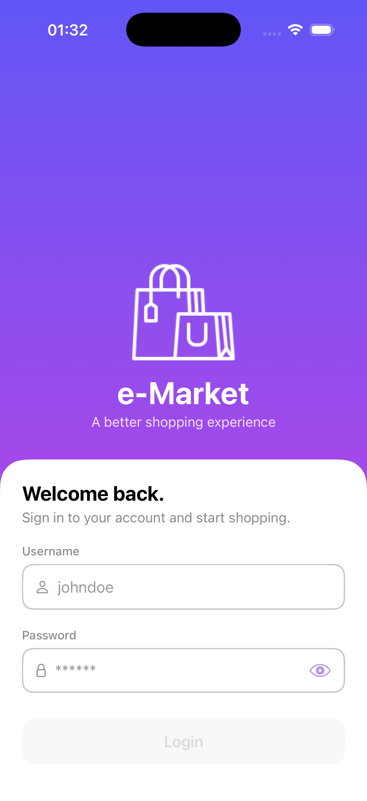
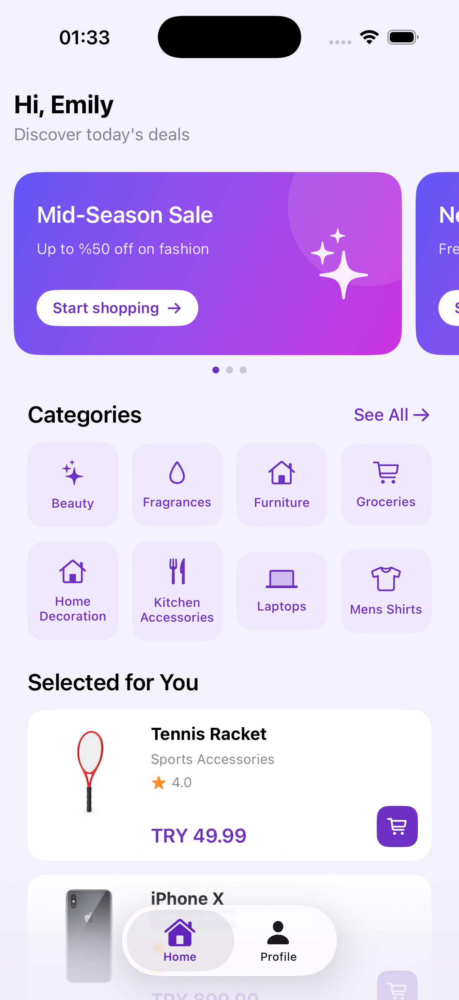
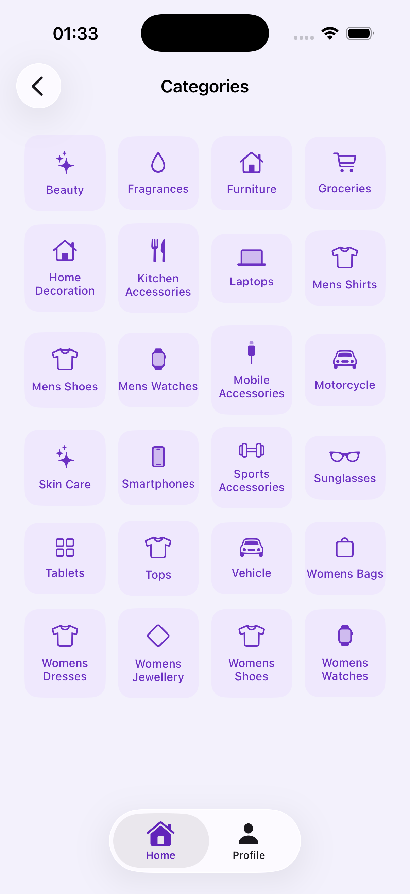
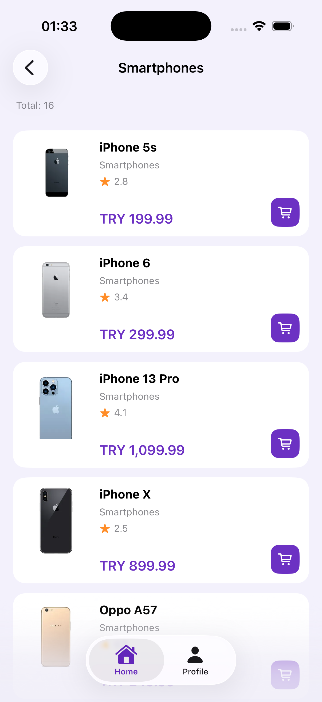
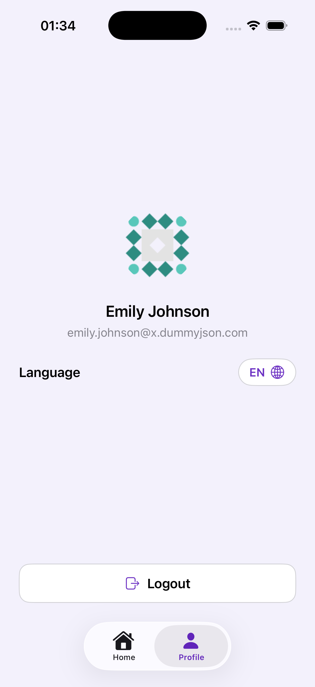
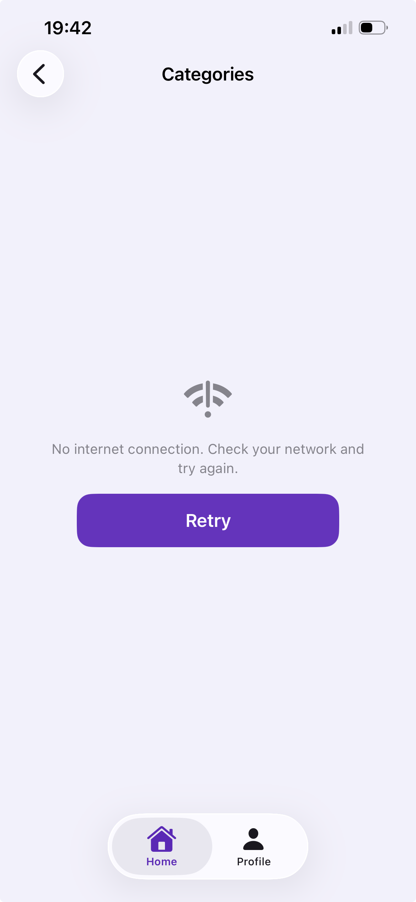
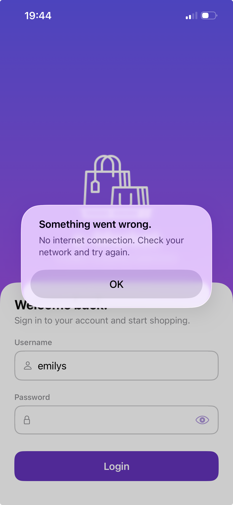
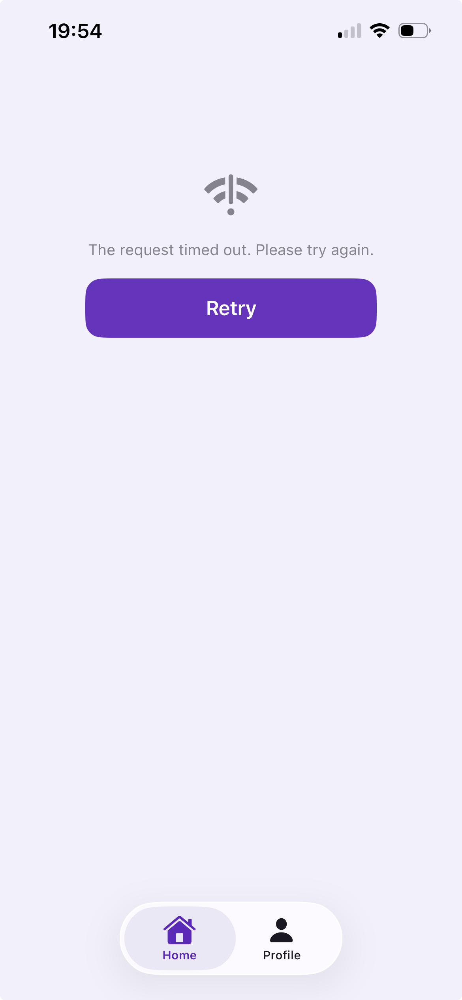
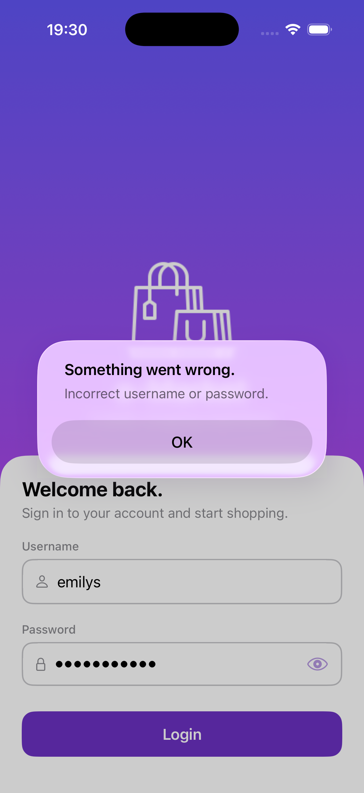

# E-Marketing
Three-screen e-commerce app (Login, Home, Product List) built with SwiftUI + MVVM + Clean Architecture on top of the DummyJSON API.
| Login | Home | Categories | Products | Profile |
|---|---|---|---|---|
|  |  |  |  |  |

## Getting Started
- Xcode 16+ / iOS 18+

## Architecture
**MVVM + Clean Architecture**, with layers physically separated into `Domain / Data / Presentation / Core` folders.

```
    e-marketing-ios/
    ├── App/                 # Composition root (@main, AppSessionStore, MainTabView, Navigation/)
    ├── Domain/              # Entities, AppError, repository interfaces, use cases
    ├── Data/                # DTOs, mappers, repository implementations
    ├── Presentation/        # View + ViewModel (feature folders), shared components
    └── Core/                # Networking (HTTPClient, Endpoint, interceptors), Security (Keychain)
```

TCA adds a lot of concepts and boilerplate but gives little in return. MVVM with async/await fits SwiftUI's own lifecycle and keeps every layer testable through protocols.

## State Management
The rule: **pick the property wrapper by who owns the state.**
| State | Choice | Why |
|---|---|---|
| Screen-local state | `@State` | SwiftUI owns it. The value survives view re-creation. |
| A ViewModel owned by its view | `@State` + `@Observable` | On iOS 17+, `@State` also keeps a reference type as one instance. It replaces `@StateObject`. |
| App-wide state (session, router, language, image loader) | `.environment(x)` + `@Environment(X.self)` | Reaches the whole tree without passing parameters manually. |
| Need a Binding | `@Bindable` | Makes `$binding` from an `@Observable` object (router.path). |
| Keyboard focus | `@FocusState` | Moving focus between login fields. |

`@StateObject`, `@ObservedObject` and `@EnvironmentObject` are not used on purpose. With the Observation framework they belong to the old
`ObservableObject` world.

## Networking
**URLSession + async/await, no third-party dependencies.** Alamofire would add a dependency and take away control, and this app does not need anything it offers.
Layers:

- **`Endpoint`** 
- **`HTTPClient`** 
- **`RequestInterceptor` (middleware)** — a chain that runs before each request. `AuthInterceptor` adds the Authorization header, so the client itself
knows nothing about auth.
- **`NetworkLogger`** — logging behind `#if DEBUG`. Bodies are always redacted (`accessToken`, `refreshToken`, `token`, `password` → `•••`, also inside
nested objects). Release builds print no network logs.

## Authentication
**Storage:** The token pair is stored in the Keychain as a generic password with `kSecAttrAccessibleAfterFirstUnlockThisDeviceOnly`. ThisDeviceOnly means it never moves to another device with a backup. Tokens are never stored in UserDefaults or any other plain-text place.
**Injection:** `AuthInterceptor` adds `Authorization: Bearer` to every request, from one place, for every method. The login request is the only exception — there is no token yet at that point.
**Session lifecycle:**

    login    → save to Keychain → isAuthenticated = true → root becomes MainTabView
    relaunch → restore() reads the Keychain → user details filled via /auth/me
    401      → expireSession(): clear Keychain + set flag → root switches back to Login
             → router.reset() (no leftover stack) → toast that dismisses itself
Token leakage into logs is blocked twice: headers are never logged, and bodies always pass through redaction.

## Pagination
Built on `GET /auth/products?limit&skip` with a `Page<T>` wrapper (`items/total/skip/limit` plus `hasMore/nextSkip`).

| Guarantee | Where |
|---|---|
| Only the **last row** can trigger the next page | `loadMoreIfNeeded: guard current.id == products.last?.id` |
| No second request while one is running | `loadMore: guard !isLoading, !isLoadingMore, !isFinished` (flags reset in `defer`) |
| No requests after the end of the list | `isFinished = !page.hasMore` guard |
| State survives tab switches | `loadIfNeeded: guard products.isEmpty` — the VM is cached in the composition root, so returning to the tab does no fetch and the scroll position stays |

The trigger is `.task(id: product.id)`: when a row leaves the screen or is reused, the old job is cancelled. Pull-to-refresh resets pagination through
`loadFirstPage()`.

## Error Handling
Errors travel through one one-way pipeline:

    URLSession (URLError)  →  HTTPClient: maps to AppError (timeout / offline / cancelled)
    HTTP status            →  validate: clientError (4xx) / serverError (5xx)
    AppError               →  messageKey (String) — Domain stays free of SwiftUI
    Presentation           →  Text(LocalizedStringKey(key)) — follows live language changes

Users see errors on three fixed surfaces, one policy:

- First load fails → inline `ErrorView` (icon + message + Retry)
- Pagination fails while the list has content → `ErrorAlert` (existing data stays on screen)
- Login fails → `ErrorAlert`

401 never reaches this pipeline. The `isSessionExpired` check routes it into the session-expiry flow above, before any message is shown.
`CancellationError` is swallowed silently — closing a screen is not an error. All messages are localized EN/TR through the String Catalog.

| Case | Proof |
|---|---|
| No internet (inline + retry) |  |
| No internet (popup) |  |
| Timeout |  |
| Generic error popup |  |
| Expired session |  |

## Performance

- **Images:** `RemoteImage` + `ImageLoader`. The DummyJSON CDN sends `cache-control: no-store`, so HTTP caching cannot help. Instead, decoded images
are kept in **NSCache** (the system evicts it under memory pressure; decoding happens off the main thread with `preparingForDisplay()`). Downloads are
bound to `.task(id: url)`, so a reused row cancels its old download.
- **Lists:** Products uses `LazyVStack` (only visible rows are built). Tile sections use `LazyVGrid`. Small sections (banners, greeting) are plain
`VStack` on purpose — lazy adds nothing there.
- **Re-renders:** the three mechanisms from the State Management section.
- **Pagination triggers:** the four guarantees above remove wasted requests, CPU and network.

## Testing

23 unit tests (**Swift Testing** — `@Suite` / `@Test` / `#expect`) + 1 UI flow (**XCUITest**).

| Group | Coverage | Why |
|---|---|---|
| `RepositoryTests` (7) | Success / 401 / timeout / malformed JSON, a 403-404-429-500 table, pagination query, category routing — via `MockURLProtocol`
| `LoginViewModelTests` (3) | Loading flag during the request, success → `onAuthenticated`, 400 → `invalidCredentials` | The ViewModel scenarios from the doc. |
| `AppSessionStoreTests` (3) | Login saves the token pair, logout deletes it, restore reads it | Token storage scenario, with a mocked `KeychainTokenStoring`. |
| `Home/Categories/ProductsViewModelTests` (10) | Loading and error states, "only the last row triggers", "no requests after the end", 401 → session expiry, `loadIfNeeded` skip | Unit-level proof of the pagination requirements. |
| `e_marketing_iosUITests` (1) | Login → Home → Categories → Product list → scroll | The required flow. The password field sits under the keyboard, so the test uses the `onSubmit` focus chain instead of tapping it. |

## Improvement Areas

What would change for production:

1. **Refresh token flow** — renew silently via `/auth/refresh` on 401; log out only if the refresh also fails.
2. **Logging destinations** — `NetworkLogger` only prints to console. OSLog and crash-SDK can be added later to the same class.
3. **Swift 6 mode** — the project is Swift 5 mode with default MainActor isolation and zero warnings. A gradual migration is planned.
4. **Cart / favorites** — the buttons are TODOs, to be built on separate feature branches.
